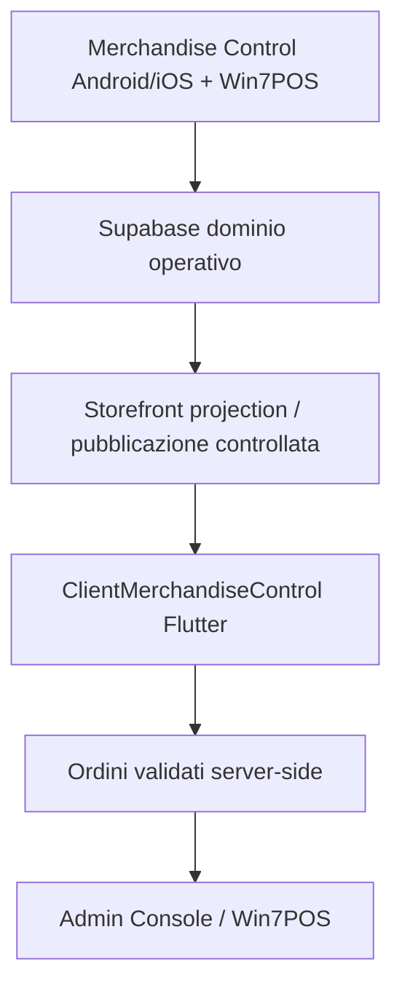

# System context

Il diagramma descrive la target architecture. TASK-001 non implementa questi collegamenti,
non interroga Supabase e non modifica gli altri sistemi.

## Confini

- Merchandise Control e Win7POS restano sistemi operativi.
- Supabase ospita il dominio condiviso, ma il client accede soltanto al futuro dominio
  pubblico Storefront.
- Admin Console è il control plane di pubblicazione.
- Mutazioni sensibili passano da funzioni/server con autorizzazione, idempotenza e audit.
