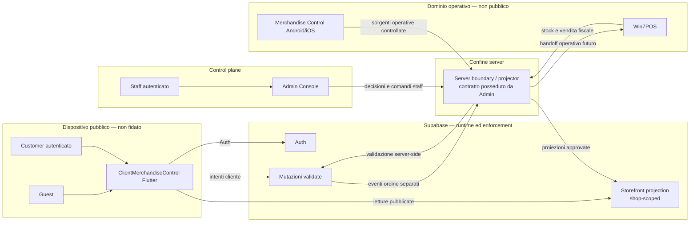

# System context

Questo documento descrive i confini logici della target architecture Storefront. Non
implica che schema, proiezioni, API o integrazioni siano già implementati.

`Server boundary / projector` è un ruolo logico. I task successivi stabiliranno se una
responsabilità concreta vive nel server Admin, in una funzione Supabase o in un altro
componente server autorizzato; TASK-003 non crea né seleziona tale implementazione.

## Responsabilità dei sistemi

| Sistema | Responsabilità | Non responsabilità |
|---|---|---|
| Client Flutter | UI cliente, navigazione, intenti, stato e cache locali, deep link e presentazione degli esiti | commercial truth, autorizzazione, pubblicazione, inventory, funzioni staff o fiscali |
| Admin Console | control plane, decisioni di pubblicazione e configurazione commerciale, contratti server-side e change ownership | esperienza mobile cliente o fiducia nello stato inviato dal client |
| Supabase | Auth, persistenza, Data API, Storage e runtime server; enforcement tramite grant, RLS e validazione | decidere cosa pubblicare, inventare prezzi o trasformare la publishable key in autorizzazione |
| Merchandise Control Android/iOS | workflow e dati operativi interni | API runtime o fallback dati per il client pubblico |
| Win7POS | stock operativo, vendita fiscale e futuro handoff operativo | catalogo pubblico, ordine cliente o accesso diretto dal client |

Admin è il decision owner del control plane e il repository corrente dell'authority
versionata per migrations, policy e contratti server-side. Supabase esegue e protegge
quei contratti, ma non diventa per questo il business decision owner. Il POS resta
authority della vendita fiscale; un ordine cliente Storefront è un'entità distinta.

## Attori e capability

| Attore | Entry point | Capability consentite | Divieti |
|---|---|---|---|
| `guest` | Client Flutter | leggere risorse Storefront pubblicate e shop-scoped | dati cliente, mutazioni autenticate, inventory e superfici staff |
| `customer` | Client Flutter con sessione valida | risorse pubblicate consentite ad `authenticated`, dati propri e intenti cliente autorizzati | dati di altri utenti, operazioni staff, decisioni commerciali e stock grezzo |
| `staff` | Admin Console | operazioni del control plane entro shop e ruolo verificati server-side | usare il client pubblico come console o affidarsi a route/UI per autorizzare |
| `server` | componente server autenticato e autorizzato | proiettare, rivalidare e applicare mutazioni con audit e idempotenza | esporre credenziali privilegiate al client o aggirare ownership e change protocol |

Guest e customer sono entrambi eseguiti su un dispositivo non fidato. Una sessione
identifica il customer, ma l'autorizzazione deriva sempre da grant, RLS e controlli
server-side. Le capability `anon` e `authenticated` sono dichiarate e verificate
separatamente: non esiste ereditarietà implicita tra i ruoli. `shop_id`, route, cache,
stato Riverpod, email e `user_metadata` sono input non fidati e non concedono
capability.

## Flussi consentiti

1. Admin decide quali dati operativi possono diventare contenuto pubblico.
2. Un projector server-side produce una proiezione Storefront separata e shop-scoped.
3. Guest e customer usano soltanto le capability dichiarate per il rispettivo ruolo; il
   customer può leggere i propri dati e inviare gli intenti autorizzati.
4. Prezzi, promozioni, disponibilità, hold e ordini vengono rivalidati dal server prima
   di una conferma.
5. Gli eventi ordine destinati alle operazioni attraversano un handoff esplicito; non
   trasformano l'ordine cliente in vendita fiscale POS.

Ogni passaggio deve fallire in modo chiuso. L'assenza o il rifiuto della proiezione
Storefront non autorizza un fallback verso tabelle operative, endpoint POS o API staff.

## Flussi vietati

- Client → tabelle, view, RPC, bucket o endpoint del dominio inventory operativo.
- Client → database, API o protocollo di Win7POS.
- Client → API di management Admin o endpoint riservati allo staff.
- Client → credenziali `service_role`, token staff, signing key o altri privilegi server.
- Android/iOS operativi o POS usati come dipendenza runtime diretta del client.
- Prezzo, promozione, disponibilità o autorizzazione derivati da cache, route,
  configurazione locale, `shop_id` fornito dal client o `user_metadata`.
- Letture o mutazioni permesse dalla sola presenza di una publishable key: grant e RLS
  restano entrambi obbligatori.

Questi divieti valgono anche se una superficie legacy risulta tecnicamente raggiungibile.
Il client consuma esclusivamente il contratto Storefront allowlisted e non effettua
discovery opportunistica dello schema.

## Ownership dell'implementazione futura

| Tratto | Task proprietario |
|---|---|
| ambienti, callback e configurazione fail-closed | TASK-004 |
| schema Storefront, migrations, grant e RLS | TASK-005 |
| projector dal dominio operativo | TASK-006 |
| pubblicazione, prezzi/promozioni e immagini | TASK-007–TASK-009 |
| contratto query, DTO, pagination e contract test | TASK-010 |
| connessione staging e backend/auth readiness | TASK-011 |
| shell cliente data-backed | TASK-012 |
| cache catalogo e freshness | TASK-017 |
| OAuth e session lifecycle customer | TASK-020 |
| carrello, disponibilità, hold, ordine e handoff POS | TASK-023–TASK-030 |

TASK-003 assegna ownership e trust boundary, ma non implementa alcuno dei tratti sopra.
I dettagli normativi sono mantenuti in `STOREFRONT-INTEGRATION-CONTRACT.md`,
`AUTH-BOUNDARY.md`, `STOREFRONT-DATA-BOUNDARY.md` e
`CROSS-REPO-OWNERSHIP.md`.
